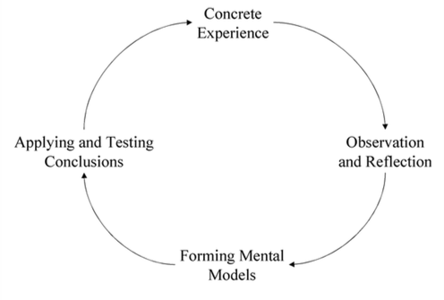

# Computer Supported Reflective Learning

In order to inform the design of technology to support crisis training, I employed the Computer Supported Reflective Learning model (hereafter CSRL model) developed by the MIRROR project. The model identify requirements to design technology to support reflective learning [@Krogstie:2013kf]. The CSRL model has worked as theoretical underpinning for the development of applications of technology presented in this PhD work, providing a language for guiding the understanding of reflection and drafting requirements for the technology.

In this thesis the CSRL model has driven the development of technology in P1, P2 and P3.

After a brief introduction about reflection theory I describe the CSRL model and how it has been applied to the development of  technology for crisis experiential learning. In the following I will use the terms *reflective learning* and *reflection* as synonyms.

## Reflection as a tool for learning from experiences

Boud [-@boud1985reflection] defines reflective learning as “a generic term for those intellectual and affective activities in which individuals [...] explore their experiences in order to lead to new understandings and appreciations”, it is both an individual and collective mental process that turns past experiences into new knowledge. This is also in line with the work of Schön [-@Schon:1983ut] who further distinguish between *reflection-in-action* and *reflection-on-action*. Reflection consists in a three-steps process during which the learner re-evaluate her experiences inspecting behaviours, ideas and feelings; eventually deriving conclusions and lessons learned to that guide future behaviours (Figure x). The process can be iterated multiple times and might influence the learner behaviours only in the long term. 

![The reflection process according with Boud [-@boud1985reflection]](imgs/boud.png)

A key aspect in making a reflective process to happen is the presence of triggers. Triggers are unexpected situations, for example disturbances and perception of uncertainty; but also positive situations like a surprising success. In general, reflection seems to be triggered by awareness of discrepancy between expectations and the current experience. Reflection might be triggered by an external event or agent (external trigger/accident) or might develop from one’s own thinking of a whole series of occurrences over time (internal trigger). Reflection can occur incidentally or intentionally, but in both cases reflection is a conscious evaluation of an experience. Furthermore people can learn not only from their own experiences, but also from other’s experience by directly or indirectly (for example by observing and reflecting on other’s experiences). 

Similar to the work of Boud, Kolb describes experiential learning as a cyclic process named “the Kolb Cycle” (Figure x). 

According with Kolb [-@kolb1984experiential] reflection is a process that involves not only reinterpreting existing experiences, but also initial perception and interpretation of the raw experience. For a description of other existing theories in reflective learning see [@WoodDaudelin199636].

### Post-crisis debriefing as an example of collaborative reflection

## MIRROR Computer Supported Reflective Learning model 

Building on the presented theories and on empirical studies, the MIRROR project has iteratively developed a model for Computer Supported Reflective Learning. The CSRL model has been designed to identify requirement, design and implement technology support for reflective learning as detailed in [@Krogstie:2013kf]. It is meant to understand and analyse reflection in the workplace, and it suggests how technology can support those activity rather than providing formal guidelines or pre-defined processes.  

Following the work of Boud et al. [-@boud1985reflection] the model considers reflective learning as “the conscious re-evaluation of experience for the purposes of guiding future behaviour […] as reflection transforms experience from work into knowledge applicable to the challenges of daily work” [@Krogstie:fo]. The model specifically addresses reflection in the workplace with *work* and *reflection on action* seen as intertwined activities that have an impact on personal, collaborative and organisational growth. Therefore the model is well suited to address reflection in the crisis domain which in which unexpected adverse events do not allow to schedule clear boundaries between the time to be dedicated to work and to learning.

![CSRL reflection cycle, figure from [@Krogstie:2013kf]](imgs/CSRL.png)

According with the model, a *reflection section* is a time-limited in which reflection happens; driven by *learning objectives* that might be only partially explicated, leaving rooms for a open-ended *outcome*. Such outcome may include a change in behaviour, new perspectives and commitment for action [@boud1985reflection]. *Participants* of the session might be a single person (individual reflection) or multiple persons (collaborative reflection).

The model explains reflective learning as a **cycle** involving fours stages of reflection: (i) do work; (ii) initiate reflection session; (iii) conduct reflection session; and (iv) apply reflection outcomes. For each stage, it specifies relevant sub-steps, specific reflection-useful activities that can be augmented with technology. For example, initiate reflection session includes *decide to reflect* and *frame the reflection session*. 

Figure x depicts the models in terms of *stages*, *inputs* and *triggers*.  A *stage* includes sub-activities that can be supported with technology, *inputs* are either raw or more or less contextualised data (information) being exchanged among stages; *triggers* are either external events or internal mental processes that initiate a reflection session. Reflection can be triggered during work, while a change is about to be applied or during the reflection session itself. In general, reflection seems to be triggered by awareness of discrepancy between expectations and the current experience. Triggers also allow for including more actors in the reflection cycles, when one reflection cycle triggers new reflection cycles. For instance, the outcome of a personal reflection (e.g. how a crisis procedure is applied) might be brought in a team meeting to trigger collaborative reflection on bring to a change of protocol outcome. In this way, we can look at reflection as a storyline that might involve different actors within the organisation [@PrPK13]. 

For each stage, the CSRL model identifies support that can be provided through technology, for example in the *do work* phase, technology can be used to monitor work and collect data that can be useful for reflection, in *initiate reflection*  technology can be used to set the objectives for reflection or involve others in the session; in *conduct reflection* session to share work experiences with others; and in *apply reflection outcomes* to decide how the change to work will be implemented.

## CSRL applied to the design of technology

The model can be used by designers to choose which technology to use to support reflection activities or do derive requirements for the design of new technologies [@Krogstie:2013kf]. The model has driven the development of several software and hardware applications within the MIRROR project; to address reflective learning in the fields of social care, health care, business and emergency aid. For a description of the applications see [@Schwantzer:2014we]. Several works [@Krogstie:2013kf; @Krogstie:fo; @Krogstie:2012ki] have shown how the four stages in the model can me mapped against technologies to support individual and collaborative reflection. 

The mapping can be framed within three macro areas:
  
- technology to **capture** work experiences (for example by means of automatic sensors, a personal diary application, or timeline visualisation) 
- technology to **re-create** work experiences based on data captured to trigger and assist a reflection session with relevant information (for example by allowing to re-evaluate a past experiences from multiple point of views, in a context that help making sense processes) 
- technology to **generate** new, realistic work experiences for training purposes (for example via virtual worlds, serious games, or tabletop exercises)  

The three areas have in common the need for interfaces between people and technology. The design of such user interfaces aims at different goals: while during *capturing* the interface need to allow to capture both automatic data and user-submitted information without interrupting crisis work, *re-creating* experiences need for tools for data visualisation and manipulation capable to re-create a work experience in a context that promote reflection; finally *generating* experiences needs interface to bring realism and engagement or real crises into a simulated environment.  
  
In the following chapter I will investigate how recent advances in the field of tangible, embodied and embedded interaction can provide theoretical tools from human-computer interaction theory and rapid prototyping techniques for the creation of user interfaces for capturing, re-creating and generating experiences.
