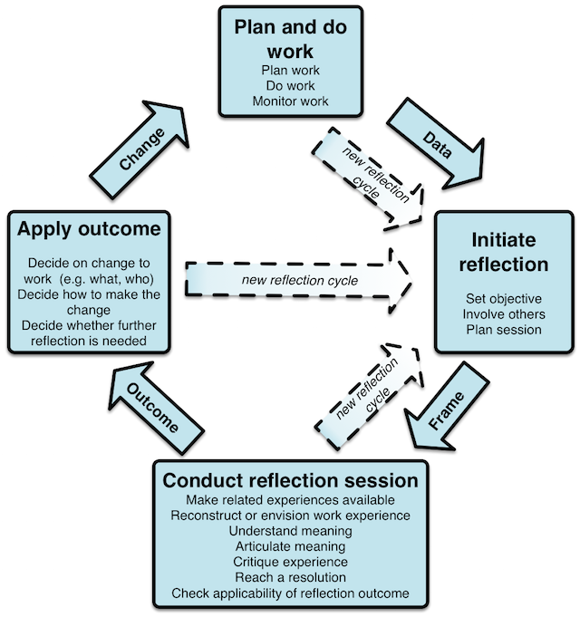

# Computer supported reflective learning

## CSRL model
Reflecting on action is critical to learn from past experiences and performing better in the future [REFs].  Different tools have been developed to support reflection, as an individual or collaborative activity. Generally, these tools provide access to information about past events. This information is important to support reflection not only to complement human memory, but also to allow bringing in multiple perspectives on collaborative processes [REF].

The CSRL (Computer Supported Reflective Learning) model (Figure model) developed as part of the MIRROR project [REF] identifies fours stages of reflection [REF]: do work; initiate reflection session; conduct reflection session; and apply reflection outcomes. For each stage, the model specifies relevant sub-steps. For example, initiate reflection session includes decide to reflect and frame the reflection session. The model explains reflective learning as a cycle involving these fours stages. For each stage, the CSRL model identifies support that can be provided through technology, for example in the do work phase, technology can be used to monitor work and collect data that can be useful for reflection, in initiate reflection session technology can be used to set the objectives for reflection or involve others in the session; in conduct reflection session to share work experiences with others; and in apply reflection outcomes to decide how the change to work will be implemented.

A key aspect in making a reflective process to happen is the presence of triggers. Reflection triggers are a critical element of the model because they initiate the reflection session (see central arrows depicted in Figure 1). Reflection can be triggered during work, while a change is about to be applied or during the reflection session itself. For instance, a collaborative reflection in a team meeting may trigger individual reflection of a participant or reflections about organisational topics.

It should be noted that one reflection cycle can also trigger new reflection cycles, for example, when a reflection session include as outcome the need to reflect on a specific aspect of work, e.g. how a crisis procedure is applied, with someone at a higher organizational level. In this way, we can look at reflection as a storyline that might involve different actors within the organization [9]. 
The CSRL model has worked as theoretical underpinning for the development of the applications presented in this PhD work, providing a language guiding for the understanding of reflection and requirements for supporting technology.

## CSRL applied, MIRROR Appsphere