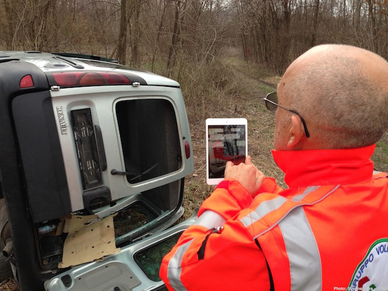

\mainmatter

# Introduction

[Revision 2]

## Problem Statement

This thesis is about how to improve crisis training with ICT technologies. Crisis training is an umbrella term for complex, collaborative activities aiming at improving people’s ability for *preparedness* to human and natural-caused disasters (e.g. a flooding or a terrorist attack). Beside teaching the population what to do when a disaster occurs, it focuses on training crisis workers (e.g. firefighters, paramedics) to efficiently response to a crisis; for example by actuating coping strategies and implementing rescue procedures (crisis management). Each crisis is likely to be a situated, unpredictable event that will not take place again under the same circumstances. Training for crisis preparedness is a wicked problem, however better crisis management can positively affect everyone’s lives.

There are four main approaches to crisis training: protocol training, tabletop exercises, physical simulations and serious games; on top of that real crises also offer triggers for learning [@Deverell:2009fk]. In this research work we look at medium to large scale physical simulations of crisis management and serious games as key training practices. Physical simulations recreate at best real crises in terms of environment (e.g. presence of debris, collapsed buildings), and in reproducing feelings experienced by crisis worker such as stress, tension, time pressure and uncertainty [@Borodzicz:2002em]. Yet these events are arranged rarely. This due to the high set-up costs and the large efforts required to coordinate multiple organisation and dozens of field workers. Moreover it has been observed that the impact of those events is limited by lack of technologies, for example for capturing data to maintain an overview of rescue efforts [@Kyng:2006he] and to support post-simulation debriefing [@Mora:2012vc]. On the other end, serious games trade the realism of physical simulations to provide a more lightweight training experience which can be reproduced frequently by single workers or teams; adding the “fun” element as motivator to engage workers in frequent play [@DiLoreto:2012jj].

\reversemarginpar

> *Hence, how it is possible to maximise crisis training learning outcomes*? \todo{This is the practical problem} 
 
The training practices already in place can be enhanced by reflective, experience-based learning practices and advances in ICT.

Experience-based learning is a powerful tool. Facilitating learning from work experiences of the different roles on field (e.g. disaster managers vs. field workers) can bring outcomes to complement traditional formal training. Learning from experiences entails reflection [@boud1985reflection; @Dewey:1998ug; @kolb1974toward]. Reflection on action has been a research topic since the work of Dewey [@dewey1933we] that describes how we learn by comparing our expectations to new and past experiences in order to promote continuous learning. Reflecting on action is critical in order to learn from past experiences with the goal of performing better in the future [@boud1985reflection; @Schon:1983ut]; a number of technology tools have been developed to support reflection, as an individual or collaborative activity. The CSRL (Computer Supported Reflective Learning) model developed as part of the MIRROR project[^mirror] aims at providing guidelines to develop technology tools to support reflection. It identifies a cycle of four stages of reflection [@Krogstie:2013kf]: *do work*, *initiate reflection session*, *conduct reflection session* and *apply reflection outcomes*. 

> *Therefore how can ICT technology to support the reflection cycle?”*\todo{This is the main research question}

In the context of crisis training, technology support for the reflective learning cycle addresses three activities: (i) *capturing work experiences* (ii) *re-creating work experiences* (iii) *generating new work experiences*. 

Technology provides help in different ways. Sensors can capture aspects of work experiences; data which can be visualised on a interactive computer interface to provide triggers for re-evaluating an experience towards a learning outcome, or that can be used to plan new training work. Yet current technology tools don’t consider the very particular, situated nature of crisis work. While data capturing tools lack of interaction paradigms suitable to be used in-action, visualisation tools struggle in providing the users with context information needed to ground the reflection process towards a learning outcome. \todo{This is the research problem}

Theory in the field of tangible, embodied and embedded interaction [@Dourish:2001vc] can inform the design of technologies to better assist reflection processes for crisis training. Tangible and embodied user interfaces are a trend in HCI aiming at enabling interaction with digital information exploiting the affordances that everyday objects provide, rather than traditional input devices such as keyboard, mouse or touchscreens. Using sensor-based technology, conventional object can be augmented and turned in “physical handles” to digital operations [@Ishii:1997ur], linking their traditional affordances to new digital meanings. 

Embodied interaction techniques can be implemented in computer interfaces to allow *capturing work experiences* disrupting as little as possible the rescue work, to *re-create work experiences* in a physical context for debriefing purposes and to *generate new work experiences* for continuous training characterised by engaging, playful interaction and reduced cost compared to traditional physical simulations.\todo{This is the research result, need to add research contributions as well?}

## Research questions

The main research question for the PhD work is:

> MRQ: How ICT technologies can introduce new opportunities to promote reflection in crisis training? 

To answer the main research question the work has been broken down into three sub-questions:

> RQ1: How computer interfaces can be designed to enable unobtrusive data collection during crisis work? 

> RQ2: How interaction techniques can be designed to facilitate the different phases of a reflection processes? 

> RQ3: How technology tools for supporting reflection can be rapid prototyped? 

While the first two questions aim at investigating the design of systems to support with technology the tasks of capturing, re-creating and generating work experiences; the third question investigates how toolkits and open-source communities can ease the implementation of design ideas into prototypes. Prototypes lies at the roots of the methodology adopted in this PhD work. Prototyping tangible and embodied user interfaces is a complex task that involves a mix of hardware, software and product design skills.    

## Research design

The work in this thesis is based on interpretative case study [@Klein:1999bm; @Walsham:2006bo] and design research [@Hevner:2010fy; @March:1995gm]. The work followed a *user centred approach* [@MAGUIRE:2001dp; @Gulliksen:2003hd], based on exploratory studies and design work following in multiple iterations. 

Several qualitative research methods methods\todo{add reference} have been adopted, including field studies, focus groups, observations, interviews and video analysis. Scenarios, personas and mockups aided the user-centred design work. These activities were functional to the *design research* approach. Consistently with this methodology, grounded on the activities of *building* artefacts for a specific purpose and of *evaluating* how well the artefacts perform [@March:1995gm], a number of prototyping iterations and evaluation studies have been performed.

Prototyping involved the construction of complex hardware and software systems to support reflection processes. The design of prototypes was driven by field studies during physical simulations of crisis I attended. Simple prototypes were initially used to build a deeper understanding of the crisis domain, for which I didn't have a previous knowledge. They acted as technology probes [@Hutchinson:2003il] and facilitate building and understanding of the crisis domain by engaging users in focus groups. Later, multiple iterations implemented a growing set of requirements in fully working prototypes robust enough to be deployed during simulated rescue work.

User evaluations followed each design iteration. The aim was both in assessing usability of the prototypes and relevance of reflection outcomes they might produce. Prototypes were evaluated both during focus groups and during large simulations of crisis response works. Results from evaluations have fed following design iterations, contributed in the validation of theory models on reflective learning and into the development of new conceptual works.

## Results and contributions

The research questions RQ1-RQ3 are answered in the following research papers:

> **P1** Mora, S., Boron, A., & Divitini, M. (2012). CroMAR: Mobile Augmented Reality for Supporting Reflection on Crowd Management. *International Journal of Mobile Human Computer Interaction*, 4(2), 88–101. 

> **P2** Mora, S., & Divitini, M. (2014). Supporting Debriefing with Sensor Data: A Reflective Approach to Crisis Training. *In Proceeding of Information Systems for Crisis Response and Management in Mediterranean Countries, ISCRAM-MED*, 196(Chapter 7), 71–84. 

> **P3** Mora, S., & Divitini, M. (2014). WATCHiT: a modular and wearable tool for data collection in crisis management and training. *In Proceeding of the European Conference in Ambient Intelligence, AMI*. 

> **P4** Di Loreto, I., Mora, S., & Divitini, M. (2012). Don’t Panic: Enhancing Soft Skills for Civil Protection Workers. *In Proceeding of International Conference on Serious Games Development Applications, SGDA*, 7528(Chapter 1), 1–12. 

> **P5** Mora, S., Di Loreto, I., & Divitini, M. A token-constraint approach to interactive board games: the case of “Don’t Panic!”. *To Be Submitted at INTERACT2015*.

> **P6** Müller, L., Divitini, M., Mora, S., Rivera-Pelayo, V., & Stork, W. Context Becomes Content: Sensor Data for Computer Supported Reflective Learning. *To Appear in the IEEE Transactions on Learning Technologies*.

> **P7** Mora, S., & Farshchian, B. A. (2010). A Unified Architecture for Supporting Direct Tag-Based and Indirect Network-Based Resource Discovery. *In Proceeding of the International Conference on Ambient Intelligence, AMI*, 6439(Chapter 20), 197–206. 

Table x shows the mapping between research papers and research questions.

--------------------------------------------------------------------
Research questions                 P1   P2   P3   P4   P5   P6   P7    
-------------------------------   ---- ---- ---- ---- ---- ---- ---- 
(1) How computer interfaces can          *    *              *
be designed to enable unobtrusive 
data collection during 
crisis work? 

(2) How interaction techniques      *    *         *    *    *
can be designed to facilitate 
the different phases of a 
reflection processes? 

(3) How technology tools for                  *         *         *
supporting reflection 
can be rapid prototyped?
--------------------------------------------------------------------- 

Table: Mapping between research papers and research questions

## Contributions

The seven paper published added to the following contributions of this research work.

> **C1:** Implementation and evaluation of MIRROR Computer Supported Reflective Learning theory

> **C2:** Challenges in designing data capturing tools for crisis workers

> **C3:** Novel interaction techniques to support re-creation and generation of work experiences in crisis training

> **C4:** Challenges in implementing prototypes to be deployed into the wild

These contributions are relevant for several research communities including Technology Enhanced Learning (C1), Tangible Embodied Embedded Computing (C3, C4), Information systems for Crisis Response (C1,C2) 

## Innovation and market research

During the late phase of the research, the innovativeness of the research has been evaluated and basis for a future commercialisation of results have been settled. To this end, I joined forces with NTNU Technology Transfer AS, a business facilitator affiliated with NTNU; and I cooperated with the NTNU School of entrepreneurship [^es] evaluating the market potential for the technology tools developed. 

Several are the outcomes of this work. I presented research results to several subjects from the industries working in the emergency management field, raising positive and supportive feedbacks. I further refined rapid prototyped ideas during an Hackaton at MIT Media Lab. Finally in November 2014 I was granted by NTNU Discovery [^discovery] a 150.000NOK (~22.000USD) seed for further developing actualise research ideas into prototypes after the completion of my PhD.  

## Context of the work

This research work is framed within the EU-funded (IST-FP7) project MIRROR. The focus of MIRROR is the creation of a set of technology applications that enable employees to learn from their own and others’ experiences to perform better in the future. As an associate researcher of MIRROR I took part in shaping the results of the projects by designing and implementing ICT systems, writing deliverables and attending project meetings. Thanks to MIRROR I cooperated with crisis workers associations partner of the consortium to run user and evaluation studies. I also benefited from discussions and joined works and publications with the members of the consortium. After the scheduled final review in September 2014, MIRROR has been graded as "Excellent" by the EU commission.

During the PhD I worked as visiting researcher in two foreign institutions: City London University[^city] and MIT SENSEable City Lab[^senseable]. The purpose of the two visits was to investigate whether the technologies developed during the PhD could be generalised to application domains that share similarities with crisis training. 

During fourteen weeks spent at City University  (partner of the MIRROR consortium) I investigated the design and production of a digitally augmented serious game for better training of dementia carers, under the supervision of professor Neil Maiden. The game has been implemented and evaluated in eight care homes in the greater London area, and is reported in a joined publication to be submitted.

During twelve weeks spent at the MIT SENSEable City Lab I investigated the design and production of a tangible interface to promote user engagement and reflection about urban-mobility data under the supervision of professor Carlo Ratti. The work has been has been displayed to the public in two exhibitions: “Wave”  currently held in Paris and “CNR Internet Festival” held in Pisa, Italy.

I also co-advised thesis works of eight master student who have contributed in the development of prototypes. One of them also co-authored P1.

## Structure of the thesis

The thesis is structured as follows:

**Chapter 2** introduces the Crisis domain providing an overview on scenarios, activities and roles; and presenting debriefing as a tool for experiential learning. 

**Chapter 3** describes relevant background theory on reflective and experience-based learning with focus on describing the Computer Supported Reflective Learning model adopted as theoretical underpinning of this research work.

**Chapter 4** presents relevant background theory in sensing based-interaction, motivating the use of that category of applied to reflective learning.

**Chapter 5** depicts the research strategy and approach adopted by this PhD work, giving and overview of the user studies conducted and prototypes built.

**Chapter 6** summarises the results for the research papers.

**Chapter 7** outlines the contribution of this thesis and their relations to the research papers.

**Chapter 8** proposes an evaluation of the work done.

**Chapter 9** concludes the thesis and sketches out future research and innovation works.

**Appendix A** contains the research papers P1-P7.

**Appendix B** contains research papers that were written during the research fellowship but that were outside the main scope of the work.\todo{Do we want to add this?}

**Appendix C** includes a benchmark of hardware toolkits for rapid prototyping which has been used to select the specific tools used to implement the prototypes in this PhD.

[^mirror]: MIRROR Project - http://www.mirror-project.eu  
[^tto]: NTNU Technology Transfer AS - http://www.tto.ntnu.no
[^es]: NTNU School of Entrepreneurship - http://entreprenorskolen.no
[^discovery]: NTNU Discovery - http://ntnudiscovery.no
[^city]: City London University - http://city.ac.uk
[^senseable]: MIT SENSEable City Laboratory - http://senseable.mit.edu