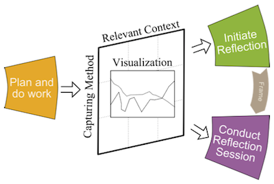

# Results

In the previous chapter the research approach and methodology adopted during the work were presented. This chapter summarises the papers that added to the contributions of my work. 

## Papers

The research work has been published in two journal papers and five conference paper, with one paper under submission. 
In this section, papers that presents the results of this thesis are summarised. Each summary includes:

* Title
* Authors and roles in the paper
* Where the paper was published 
* A short description to results
* The paper’s addition to contributions (?)
* The paper’s relation to research questions

Each of the eight papers have been peer-reviewed. Papers are reprinted in full in Part II of the thesis. 

In addition to the papers presented in this section this PhD work has produced fourteen peer-reviewed papers presented in conferences and workshops which are omitted in this section. Those works present incremental achievements in research that lead to the results presented of papers presented here. 

The paper summaries are ordered according with …

## Paper 1

*Title*: CroMAR: Mobile Augmented Reality for Supporting Reflection on Crowd Management

*Authors*: Simone Mora, Alessandro Boron and Monica Divitini

*Authors’ contributions*: Mora lead the design research and reported results in the paper. Boron developed the described prototyped and described its technical implementation. Divitini provided feedback throughout both the design and writhing processes. 

> *Abstract: * This paper discusses the usage of Mobile Augmented Reality (MAR) to support reflection on past events, us-ing reflection on crowd management as scenario. Computer based support to reflection generally relies on the visualization of information connected to the experience one is reflecting upon. Different metaphors have been adopted to support easy access to relevant information within the reflection process, e.g., timelines and word clouds. In this context, MAR represents an interesting alternative because it can be used to promote reflection in the specific location of the event by augmenting it with relevant information. In this way, the authors can expect the reflection process to be grounded in a context that helps to make sense of the infor-mation and reflect on alternative paths of action. The paper presents the scenario of usage, together with the design, development, and evaluation of the prototype, CroMAR. Based on this experience, the authors identify challenges connected to the usage of Mobile Augmented Reality in terms of support for reflection, interaction, and design methodology. 

*Published in*: International Journal of Mobile Human Computer Interaction (IJMHCI)

*Description*: This paper investigates the adoption of Mobile Augmented Reality (MAR) to support debriefing of work practices that rely on management of resources in space. To date, it is the first time that MAR is used for such purpose. Crowd management, an activity performed by civil protection organisation during large public event, is used to build a case in favour of the use of augmented reality to support reflection processes after the event is concluded. Crowd management is critical both for crisis preparedness and during crisis management. 

CroMAR, an iPad app designed by the authors, is presented as a demonstrator of the use of MAR for reflection. The system developed focuses on supporting navigation of reflection-useful information along the time and space dimension. Also the system provide support in involving others in the reflection process and in sharing of the outcomes. 

The proposed design has been implemented in a working prototype running on iPads, with focus on modularity and extensibility. The prototype has been evaluated in a focus group with experts. The study highlighted challenges in supporting learning with MAR tools and the overall user experiences. First it required a better understanding of the conditions that makes MAR a better approach compared to other information visualisation tools (e.g. maps, timelines). Second, it claimed the need for providing scaffolding mechanisms to the reflection process to make sure that relevant information for a given session is explored. Acknowledged by experts that physical exploration of space provide scaffolding for exploration of information, it is necessary to study when the effectively actually promotes reflection. The user experience with the prototype is hampered by lack of functionalities and lack of suitable hardware platforms. The experience is disrupted by the lack of tools for filtering the data visualised, to remove redundant information and prioritise the important one. On the other side, the choice of iPads 2 has limitation due to device weight and size which can only be comfortably hold by the user for a few minutes.

The results from this paper have fed new design iterations for CroMAR. The design of new functionalities has followed more closely the guidelines provided by the CSRL model that was being developed. At the same time lighter and smaller version of the iPad came to the market which allowed an extended use for our system. A new prototype of CroMAR and its closer mapping to the CSRL model is described in P2.

*Relation to the research questions: * The paper started the investigation of RQ2, “How tangible and playful interaction
with digital information can help in engaging reflection processes?”  

## Paper 2

*Title:* Supporting Debriefing with Sensor Data: A Reflective Approach to Crisis Training 

*Authors:* Simone Mora and Monica Divitini

*Authors’ contributions:* Both Mora and Divitini wrote the paper. Mora lead the design process for the technology presented and partially implemented the prototypes presented. Both authors attended the evaluation studies.

> *Abstract:* In this paper we present our exploration into the use of sensor data to promote debriefing after training events simulating work experiences. In this way we address one of the core challenges of crisis training, namely the difficulty to exploit the full potential of training events, e.g. during drills. The paper is theoretically grounded in the theory of reflective learning. The theoretical understanding is used for informing the design of WATCHiT, a wearable device for collecting sensor data during an event, and two applications for promoting debriefing in two different scenarios, CroMAR and Procedure Trainer. CroMAR supports disaster managers during in-situ debriefing after large events, while Procedure Trainer supports a team in reflecting after the simulation of a medical emergency procedure. The evaluation of the two applications shows that sensor data can be successfully used to support debriefing in both scenarios. Based on our experience, we draw lessons learned for the design of systems supporting debriefing in training events. 

*Published in:* Proceedings of Information Systems for Crisis Response and Management in Mediterranean Countries (ISCRAM-MED)

*Description:* The paper focuses on supporting with sensor data the activity of debriefing after training events simulating work experiences (e.g. drills). To increase the efficacy of debriefing, and thus their impact on crisis preparedness, it is important to exploit the full potential of training events, which are costly to organise. Yet there are different forms of debriefing all complex activity that may vary in terms of details and people involved according with the emergency scenario workers have been training on. Also they are made difficult by the highly distributed nature of the work, the co-existence of different partial experiences and lack of data to complement human memories of the event. The paper addresses those challenges presenting an ecology of three applications of technology to assist two different debriefing scenarios.  Two applications: CroMAR and WATCHiT have been described in P1 and P3 and are here presented in the last stage of their evolution. Trainer is an smartphone application to support a quick reflection session on the implementation of protocols (e.g. medical procedures) that can be done by the worker herself or in a team. The three applications have been evaluated during simulated crisis work events attended by the authors. Also technology mapping with the CSRL model is made explicit. 

The paper contributes presenting lesson learnt, derived from the authors experiences in building the systems and results from evaluations, of the use of sensor data for supporting debriefing. Those propositions can be used by systems designers to create technologies both to capture and visualise data with the goal to better support reflection during debriefings. *First* it is acknowledged that sensor data has to be complemented by qualitative information in order to set the right focus for reflection and avoid over-sighting qualitative, yet critical aspects of the work that cannot be captured with technology. *Second* it suggests the use of *visualisation* and *storytelling* as tools as mechanisms to promote sense making process that make data useful. Visualisation helps making sense of the data by *re-creating* a context that help spotting discrepancies with other data source that in turns trigger reflection. For this goal it is important that systems allow to compare data against a baseline or other source. Storytelling happens when a visualisation need to be interred and explained both to the self and to others, connecting it to the human memory of the event; as we observed during evaluations. Also, how to motivate the user in capturing data needed for visualisation and storytelling is still an open challenge. *Third*, the proposed technologies aims at bringing debriefings out of the traditional office setting but not as substituting, rather to complement the current practices creating smooth transition among different debriefing (and thus reflection) cycles. These propositions will guide future research to leverage sensor data in debriefings.

*Relation to the research questions: * The paper covers aspects of RQ1 “How sensor-based interfaces can enable pervasive and unobtrusive data collection at work?” and RQ2, “How tangible and playful interaction with digital information can help in engaging reflection processes?”  

## Paper 3

*Title:* WATCHiT: a modular and wearable tool for data collection in crisis management and training 

*Authors:* Simone Mora and Monica Divitini

*Authors’ contributions:* Mora and Divitini wrote the paper. Mora designed conducted the design research presented and took part to field studies and evaluations. Divitini provided feedback throughout both the design and writhing processes. 

*Published in:* Proceedings of the European Conference in Ambient Intelligence (AMI) 

> *Abstract:* We present WATCHiT, a prototype of sensor-augmented wristband computer for data collection during crisis response work. During crises, information about the environment (e.g. to map the territory) and the rescuers (e.g. for assessment of workers’ condition) offers help to support coordination of work, post-emergency debriefing and to build realistic training scenarios. Being each crisis nearly unique it is important to collect data from every single occur- rence, yet it is difficult to foresee the type of data and context information that is relevant to capture. WATCHiT features: (1) wearable sensors, (2) easy customization of the type of information sensed, including both quantitative and qualitative data; (3) an intuitive, distraction-free user interface for controlling the data capturing procedure. Our design process has been driven by user studies during training events characterised by a high degree of realism; our proto- type has been successfully evaluated with experts against technology acceptance. 

*Description:* This paper presents the design research that led the development of WATCHiT, a wearable computer for data collection in-action during crisis response work. The design research has followed four steps. Multiple user studies conducted by the authors have produced seven challenges for the design of technology tools to support data collection during real or simulated crisis. User studies were performed during simulated crisis event organised for training purposed. Simulations were organised to provide a high degree of realism, involving dozens of agents; and recreating working conditions as close as possible to real crises. 

The drafted challenges highlight *what* data is relevant to be captured and *how* to collect it. The challenges aim at assisting the design of technology to capture data during crisis work; how the data is used is outside the scope of the paper yet data is essential to feed debriefing as well as helping coordination on the field and support decision-making process.

The challenges drove the design of WATCHiT by establishing three core requirements for the technology. WATHCiT should be implemented to be *wearable* -to achieve the highest degree of mobility in sensing-, *modular* -to be allow customisation of the type of data captured to specific crisis scenarios-; finally it has to feature a *distraction-free user interface* to disrupt as little as possible the work. The requirements were gradually implemented during three prototyping iterations. The working prototyping build, a mix of software and hardware technology, feature an increased degree of wearability (Figure X). Modularity is implemented as an architectural choice with physical sensor modules that allow for transient customisation of sensing capabilities and the capability of the device to share data with information systems. Indeed WATCHiT is a generic tool that acts as input interface and can be connected to several application logics. 

The requirement for distraction-free user interfaces is implemented with the creation of a novel interaction paradigm based on previous works on mnemonic body shortcuts and body-centric interaction. Those researches proposed to use areas of the body as shortcuts to trigger digital operations to facilitate smartphone-mediated interaction with digital services. In this work body shortcuts are specialised to assist data capturing processes. Areas of work uniforms and tools (Identified by RFID tags) trigger digital operation when the worker hover WATCHiT on. Each shortcut can be pre-configured to control the activation of specific sensors and to tag the data the is being captured with contextual information. User evaluation has shown that the this interaction technique is well accepted and WATCHiT is suitable to be used during simulated crisis work.

WATCHiT has been used to capture data tu feed technology assisted debriefings thanks to the integration with the CroMAR and Trainer app, as described in P2. A new prototype and summative evaluation for the tool is described in P6.

*Relation to research questions:* The paper covers aspects of RQ1 “How sensor-based interfaces can enable pervasive and unobtrusive data collection at work?” 

## Paper 4

*Title:* Don’t Panic: Enhancing Soft Skills for Civil Protection Workers.

*Authors:* Ines Di Loreto, Simone Mora and Monica Divitini

*Authors’ contributions:* Di Loreto lead the design research and wrote the paper. Mora and Divitini provided feedbacks about the game design

*Published in:* Proceedings of the International Conference on Serious Games Development Applications (SGDA)

> *Abstract:* Don’t Panic is a serious game created to enhance soft skills in the crisis management field. The game is conceived to (i) add the fun element to training about stressful situations linked to panic management and (ii) teach skills such as communication styles, team management and coordination, time management, stress management and coping strategies. In this paper we present the first paper-based version of the game and its evaluation. The paper discusses the game design motivations, the methodological reasons behind its conception, and presents a pilot study. Results show that, even in its paper version, the game is a promising tool if linked with adequate and realistic procedures. This opens methodological questions about the role of computer based serious games. 

*Description:* The paper investigates the use of collaborative and mobile serious games as tools to enhance soft skills in crisis work. Serious games can complement traditional formal training by enhancing workers’ communication abilities, stress management and coping skills. The fun element brought by game dynamic can act as motivation factor to engage workers in training. After presenting the state of the art of serious games for crisis training, the paper dive into the description of a board game designed by the authors, *Don’t Panic*. The game aims at training soft skills in the management of situations where digestion of panic might put population at risk.

Don’t Panic is a cooperative board game inspired by Pandemic. Each player starts the game as member of a panic control team that must work together to manage panicked crowds. During a game session different potential panicking events take place in the city represented on the board. Each player assumes a unique role within a team, with special abilities that improve the team’s chances, if applied wisely. The players have a limited time to calm down the situation, before the panic will spread and they will lose the game. Don’t Panic has multiple aims linked to soft skills teaching and learning. In fact the game wants to teach communication styles useful to manage crisis events but also foster team building. The game was conceived to push local vs. global reasoning, problem dissection and making plans dividing the board into zones and adding unpredictable events during the game that can create contrasting reasoning and priorities.

The paper details game mechanics and rules. A paper prototype of the game is presented and evaluated in a pilot study with 10 civil protection experts who played the game. Building on the evaluation results the authors derive implications for the design of a technology-augmented version of the game (that will be presented in P5). Technology is considered valuable to release the players from doing game management tasks which disrupted the game experience in the paper mockup. Moreover it can be used to increase information visualisation and add interactive behaviours to game mechanics. Secondly, technology can improve the learning effectiveness by the game by logging players action to be used as traces for reflection. After a game session, the game traces captured can be used to help players reflect on the actions taken during the game, and to link those actions to their real work past experiences. 

Don’t Panic aims at generating a realistic work experience…

The pilot study and the derived implication for design have driven the creation of an computer version of the game presented in P5.

*Relation to the research questions: * The paper contributes to the investigation of RQ2, “How tangible and playful interaction
with digital information can help in engaging reflection processes?” 

## Paper 5 

*Title:* A token-constraint approach to interactive board games: the case of “DoomTown”

*Authors:* Simone Mora, Ines Di Loreto and Monica Divitini

*Authors’ contributions:* Mora led the design work and writing of the paper. Di Loreto designed rules and mechanics for the game presented. Both Di Loreto and Mora attended evaluation studies. Divitini provided feedback throughout both the design and writhing processes. 

*Published in:* Submitted at INTERACT 2015

> *Abstract:* Recent advances in interactive surfaces and Tangible User Interfaces have created a new interest in digital board games, aiming at mixing the benefits of traditional board games with the interactivity of video games. Within this strand of research we propose a new approach centered on the concepts of tokens, constraints, spatial expressions and interaction events. Rather than implementing game dynamics using interactive surfaces, this approach relies on physical manipulation of interactive objects on conventional surfaces. We illustrate the proposed approach by describing the design and development of DoomTown, a collaborative interactive board game. Building on feedbacks from user evaluations and our experience with the development, we outline design opportunities and challenges of the approach. 

*Description:* The paper presents a novel approach to the digitalisation of board games. The approach aims at adding computer games interactivity to board games preserving their traditional social and physical affordances. Rather than implementing games with interactive surfaces (e.g. touchscreens) the approach relies on the physical manipulation of interactive objects on conventional surfaces. After reviewing state of the art technology for board games implemented as interactive surfaces, the approach is presented and grounded in existing frameworks of tangible user interfaces. To implement the approach into the design practice of digital board game a three-step process is presented. The process provides guidelines for designing computer-augmented game pieces and for mapping sensor-based interactions with game pieces with game dynamics.

P4 introduced Don’t Panic, a serious board game for enhancing soft skills in crisis workers, pointing out the role of technology as facilitator for generating an engaging game experience and to support post-game reflection and mapping with the real work. The approach and process presented in this paper have been used to drive a new design iteration for Don’t Panic. The new game, called DoomTown, shares the same game mechanics and learning objectives of Don’t Panic. The capability of the described approach to create games that preserve social affordances in terms of cooperations and prompts for discussions is functional to the serious role of the game as facilitator of discussions and team building. Indeed players’ interaction with technology during the game have been designed to promote discussions via extended visibility and simultaneous actions. At the same time the added computer interactivity provides a game experience which is more immersive and less disrupting compared to the paper mockup presented in P4. This allows for generating, by means of the game, a simulated work experience (management of panicking crowds) that re-create as much as possible conditions of emotional stress and decision making under time constraints, typical of real work. Beside the DoomTown result the approach itself is a contribution in the field of TUIs which can drive the digitalisation of serious or non-serious board games.

DoomTown has been implemented in a working prototype, expression of the technical challenges of building complex systems of sensor-based tangible user interfaces. A mix of software, hardware and 3D and laser-cut printing techniques have been orchestrated in order to fully implement game dynamics and produce a prototype of a game that can be played for an intere session without major disruptions.

The prototype has been evaluated against usability with 16 players. Results contributes in shedding the light on opportunities and challenges of the approach developed compared to the mainstream use of interactive surfaces.

*Relation to the research questions: * The paper contributes to the investigation of RQ2, “How tangible and playful interaction
with digital information can help in engaging reflection processes?” and RQ3, “How digital manufacturing and open source hardware and software can inform rapid prototyping of sensor-based human-computer interfaces for capturing and visualising reflection-useful data?”

## Paper 6

*Title:* Context Becomes Content: Sensor Data for Computer-Supported Reflective Learning 

*Authors:* Lars Müller, Monica Divitini, Simone Mora, Verónica Rivera-Pelayo and Wilhelm 

*Authors’ contributions:* Müller led the writing of the paper. Mora designed the systems presented in the second case study of paper. Both Mora and Divitini designed and conducted the evaluation study. Divitini provided feedback throughout the work.

*Published in:* To Appear in IEEE Transactions on Learning Technologies

> *Abstract:* Wearable devices and ambient sensors can monitor a growing number of aspects of daily life and work. We propose to use this context data as content for learning applications in workplace settings to enable employees to reflect on experiences from their work. Learning by reflection is essential for today’s dynamic work environments, as employees have to adapt their behaviour according to their experiences. Building on research on computer-supported reflective learning as well as persuasive technology, and inspired by the Quantified Self community, we present an approach to the design of tools supporting reflective learning at work by turning context information collected through sensors into learning content. The proposed approach has been implemented and evaluated with care staff in a care home and voluntary crisis workers. In both domains, tailored wearable sensors were designed and evaluated. The evaluations show that participants learned by reflecting on their work experiences based on their recorded context. The results highlight the potential of sensors to support learning from context data itself and outline lessons learned for the design of sensor-based capturing methods for reflective learning. 

*Description:* This paper proposes the use context data as content to support informal learning in workplace settings. An approach to the design of tools supporting reflective learning at work is presented. The approach makes use of technology to turn unstructured context data into learning contents, two case studies are presented. The approach facilitates designers in mapping requirements from reflective learning theory with opportunities provided by technology and within the constraints of the specific workplace environment. 

Three design decisions have to be made to turn context into content: *what context* is relevant to be captured, *how to capture* it and *how to visualise* it to support reflection. The first two decisions were already explored in the design challenges for data capturing tools (P3). In this paper they are further elaborated. 

It is found that the decision of *What context* to be captured is highly situated with the work experience to be acquired. This is made harder by the unpredictability of outcomes and lack of clear definition of learning goals, typical of informal learning; and by the subjectivity and need for interpretation to extract from context data that relates to a specific experience. Yet the paper identifies three types of context that may include relevant data for reflection: task, affective and social. *Task context* relates directly to the work process and is therefore easy to understand. *Affective context* might work as a marker to recognise relevant episodes for reflection since if something  happens during the day, it will trigger an emotional reaction that can be captured with sensors. Finally *social context* is important for many collaborative work practices since interactions with other people (colleague, customers, patients) is constitute an important aspect of experiences to reflect upon.

*How to capture context* is also further elaborated in the paper. Three methods are proposed. Data can be *self-reported* by the users, thus providing a subjective impression on an experience, for example by means of digital diaries. Data can be *self-reported from third parties* in which an external perspective to the reflecting person. Finally data den be captured *automatically* by sensors and application, for example by means of stress and activity trackers.     

Compared to P3 the paper also add third challenge connected to *visualisation of context*. In order to be effective in trigger and sustain a reflection sessions, data should be visualised from multiple perspective, depending on the criterion taken in account. Discrepancies among different view of the same experiences should be outlined as reflection triggers. The social (comparing data over multiple users), spatial (the location data were captured) and historical perspective (evolution of data samples over time) are considered as effective for reflection. The CroMAR app (P1) and Trainer app (P2) were designed to visualise data according with one or more of those perspective.

The three design dimensions are functional to build technology tools that implement the stages of the CSRL cycle (Chapter X). While what context and how to capture it pertains designing of technology to support the *plan and do work* stage of the model, *how to visualise data* provides support for the subsequent stages of *initiate reflection* and *conduct reflection session* (Figure X). To motivate the user in the data collection process methods borrowed persuasive technology and quantified self are presented.

The paper further presents two case studies and their evaluation. One of the cases show the use of WATCHiT (P3) and Trainer (P2) to support reflection on the implementation of protocols (e.g. medical procedures) by workers in the field, immediately after the procedure is performed. The system promotes a quick reflection session with easy triggers that can be done by the worker herself or collaboratively by a team. The second case study is an application designed su support carers in dementia care homes by reflecting on their daily interaction with residents and colleagues. Both case studies address users, carers and crisis workers, that work in highly dynamic environments and therefore benefit the most from on-the-job training.

The system evaluations presented in the two case studies show that participants in both studies were able to learn from the visualised context. Yet, it is confirmed that learning goals and expected outcomes are difficult do define a priori. In this light it is critical when designing tools to find a balance between defining an overall learning goal and provide a structure reflection session, versus a more open-ended one. It is also considered critical to provide an option to record reflection outcomes, so that the gained insight can be user later (and trigger new reflection cycles), as implemented in CroMAR (P1)

Capturing tools should be easy to adapt, in order to allows the users to deal with the unpredictability of relevance of the captured context. This has been implemented in WATCHiT (P3) by means of physical sensor modules.

*Relation to the research questions: * The paper dresses RQ1 “How sensor-based interfaces can enable pervasive and unobtrusive data collection at work?” and RQ2, “How tangible and playful interaction with digital information can help in engaging reflection processes?”  

## Paper 7

*Title:* A Unified Architecture for Supporting Direct Tag-Based and Indirect Network-Based Resource Discovery.

*Authors:* Simone Mora and Babak Farshchian

*Authors’ contribution:* Mora conducted the design work and wrote the paper. Farshchian provided feedbacks throughout both the design and writhing processes. 

*Published in:* Proceedings of the European Conference on Ambient Intelligence (AMI)

> *Abstract:* Discovering and integrating ambient computational resources is a central topic in AmI. There are two major existing approaches: indirect network-based resource selection and direct tag-based resource identification. We motivate the need to integrate the two approaches through a scenario. We then present an architecture for a pluggable discovery system called UbiDisco. We demonstrate how UbiDisco implements a seamless integration of the two approaches at user interaction level through a framework for implementing discovery actions. 

*Description:* This paper presents an modular approach to service discovery in smart environments that blends the benefits of direct tag-based and indirect network-based discovery. The approach has been implemented in a middleware, called *UbiDisco*, that allows for end-user discovery and customisation of computational resources and support data exchange between heterogeneous systems. The system hinder the user from the complexity of dealing with multiple data exchange protocols and in the setup of the first connection between devices.

The works constitute the foundation of the rapid prototyping approach taken by the work in this PhD. Enable users to easily connect and exchange different system is critical to allow ecologies of devices and apps to support the reflection cycle. For example in some scenarios multiple WATCHiT (P3) can be connected to CroMAR (P1) du support debriefing after large events; while the same devices could be connected to Trainer (P2) to support debriefing after procedure training.
